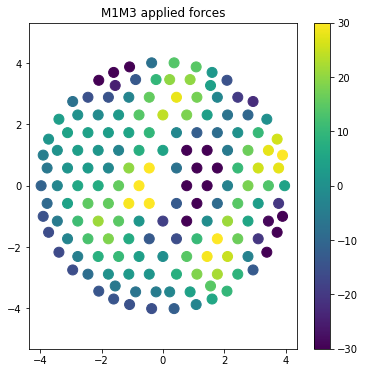

.. _integration-milestone-pf:

Integration Milestone Pf
========================

This notebooks executes IMpf. Details about the milestone, execution and
verification can be found in `tstn-031 <https://tstn-031.lsst.io>`__.

.. code:: ipython3

    import os
    import copy
    import yaml
    import asyncio
    import logging
    
    import numpy as np
    import matplotlib.pyplot as plt
    
    from lsst.ts import salobj
    from lsst.ts import idl
    from lsst.ts import utils
    
    from lsst.ts.observatory.control.maintel import MTCS, ComCam
    from lsst.ts.observatory.control.utils.enums import RotType

.. raw:: html

    <pre style="margin: 0.1em;
    padding-left: 0.25em;
    border-left-style: solid;
    font-family: var(--jp-code-font-family);
    font-size: var(--jp-code-font-size);
    line-height: var(--jp-code-line-height);
    ">lsst.ts.utils.tai INFO: Update leap second table</pre>

.. raw:: html

    <pre style="margin: 0.1em;
    padding-left: 0.25em;
    border-left-style: solid;
    font-family: var(--jp-code-font-family);
    font-size: var(--jp-code-font-size);
    line-height: var(--jp-code-line-height);
    ">lsst.ts.utils.tai INFO: current_tai uses the system TAI clock</pre>

Basic definitions
-----------------

This section defines the basic SAL communication and control classes
that are used to drive the system.

.. code:: ipython3

    STD_TIMEOUT=5

.. code:: ipython3

    domain = salobj.Domain()

.. code:: ipython3

    mtcs = MTCS(domain)

.. code:: ipython3

    mtcs.set_rem_loglevel(logging.ERROR+1)

.. raw:: html

    <pre style="margin: 0.1em;
    padding-left: 0.25em;
    border-left-style: solid;
    font-family: var(--jp-code-font-family);
    font-size: var(--jp-code-font-size);
    line-height: var(--jp-code-line-height);
    ">MTHexapod INFO: Read historical data in 0.04 sec</pre>

.. raw:: html

    <pre style="margin: 0.1em;
    padding-left: 0.25em;
    border-left-style: solid;
    font-family: var(--jp-code-font-family);
    font-size: var(--jp-code-font-size);
    line-height: var(--jp-code-line-height);
    ">MTHexapod INFO: Read historical data in 0.04 sec</pre>

.. code:: ipython3

    await mtcs.start_task

.. parsed-literal::

    [None, None, None, None, None, None, None, None, None, None]

.. _setting-up-the-system:

Setting up the system
---------------------

In order to execute the IM we need to make sure the MTCS components are
in ENABLED state, that M1M3 is raised and the force balance system is
enabled in both M1M3 and M2. We also want to enable the compensation
mode on both the Camera and M2 Hexapods, though this is not strickly
required.

--------------

Enable all MTCS components
~~~~~~~~~~~~~~~~~~~~~~~~~~

The following cell will make sure all MTCS components are in enabled
state.

.. code:: ipython3

    await mtcs.enable(settings=dict(mtm1m3="Default"))

.. raw:: html

    <pre style="margin: 0.1em;
    padding-left: 0.25em;
    border-left-style: solid;
    font-family: var(--jp-code-font-family);
    font-size: var(--jp-code-font-size);
    line-height: var(--jp-code-line-height);
    ">MTCS INFO: Enabling all components</pre>

.. raw:: html

    <pre style="margin: 0.1em;
    padding-left: 0.25em;
    border-left-style: solid;
    font-family: var(--jp-code-font-family);
    font-size: var(--jp-code-font-size);
    line-height: var(--jp-code-line-height);
    ">MTCS INFO: All components in &lt;State.ENABLED: 2&gt;.</pre>

--------------

Setup M1M3
~~~~~~~~~~

The following cells will raise M1M3, switch on the force balance system
and reset the forces. We make sure to reset the forces so that we know
the system is in the standard state, without any additional forces
applied by previous users.

.. code:: ipython3

    await mtcs.raise_m1m3()

.. raw:: html

    <pre style="margin: 0.1em;
    padding-left: 0.25em;
    border-left-style: solid;
    font-family: var(--jp-code-font-family);
    font-size: var(--jp-code-font-size);
    line-height: var(--jp-code-line-height);
    ">MTCS INFO: M1M3 current detailed state {&lt;DetailedState.ACTIVEENGINEERING: 11&gt;, &lt;DetailedState.ACTIVE: 7&gt;}. Nothing to do.</pre>

.. code:: ipython3

    await mtcs.enable_m1m3_balance_system()

.. raw:: html

    <pre style="margin: 0.1em;
    padding-left: 0.25em;
    border-left-style: solid;
    font-family: var(--jp-code-font-family);
    font-size: var(--jp-code-font-size);
    line-height: var(--jp-code-line-height);
    ">MTCS WARNING: Hardpoint corrections already enabled. Nothing to do.</pre>

.. code:: ipython3

    await mtcs.reset_m1m3_forces()

--------------

Setup M2
~~~~~~~~

The following cells will enabled the force balance system and reset the
forces on M2. As with M1M3, we reset the forces to make sure the sustem
is in the standard state, without any additional forces applied by
previous users.

.. code:: ipython3

    await mtcs.enable_m2_balance_system()

.. raw:: html

    <pre style="margin: 0.1em;
    padding-left: 0.25em;
    border-left-style: solid;
    font-family: var(--jp-code-font-family);
    font-size: var(--jp-code-font-size);
    line-height: var(--jp-code-line-height);
    ">MTCS INFO: M2 force balance system already enabled. Nothing to do.</pre>

.. code:: ipython3

    await mtcs.reset_m2_forces()

--------------

Setup Camera Hexapod
~~~~~~~~~~~~~~~~~~~~

The following cells will enable compensation mode and reset the position
of the Camera Hexapod.

.. code:: ipython3

    await mtcs.enable_compensation_mode("mthexapod_1")

.. raw:: html

    <pre style="margin: 0.1em;
    padding-left: 0.25em;
    border-left-style: solid;
    font-family: var(--jp-code-font-family);
    font-size: var(--jp-code-font-size);
    line-height: var(--jp-code-line-height);
    ">MTCS WARNING: Compensation mode for mthexapod_1 already True. Nothing to do.</pre>

.. code:: ipython3

    await mtcs.reset_camera_hexapod_position()

.. raw:: html

    <pre style="margin: 0.1em;
    padding-left: 0.25em;
    border-left-style: solid;
    font-family: var(--jp-code-font-family);
    font-size: var(--jp-code-font-size);
    line-height: var(--jp-code-line-height);
    ">MTCS INFO: Camera Hexapod compensation mode enabled. Move will offset with respect to LUT.</pre>

.. raw:: html

    <pre style="margin: 0.1em;
    padding-left: 0.25em;
    border-left-style: solid;
    font-family: var(--jp-code-font-family);
    font-size: var(--jp-code-font-size);
    line-height: var(--jp-code-line-height);
    ">MTCS INFO: Camera Hexapod in position: False.</pre>

.. raw:: html

    <pre style="margin: 0.1em;
    padding-left: 0.25em;
    border-left-style: solid;
    font-family: var(--jp-code-font-family);
    font-size: var(--jp-code-font-size);
    line-height: var(--jp-code-line-height);
    ">MTCS INFO: Camera Hexapod in position: True.</pre>

--------------

Setup M2 Hexapod
~~~~~~~~~~~~~~~~

The following cells will enable compensation mode and reset the position
of the M2 Hexapod.

.. code:: ipython3

    await mtcs.enable_compensation_mode("mthexapod_2")

.. raw:: html

    <pre style="margin: 0.1em;
    padding-left: 0.25em;
    border-left-style: solid;
    font-family: var(--jp-code-font-family);
    font-size: var(--jp-code-font-size);
    line-height: var(--jp-code-line-height);
    ">MTCS WARNING: Compensation mode for mthexapod_2 already True. Nothing to do.</pre>

.. code:: ipython3

    await mtcs.reset_m2_hexapod_position()

.. raw:: html

    <pre style="margin: 0.1em;
    padding-left: 0.25em;
    border-left-style: solid;
    font-family: var(--jp-code-font-family);
    font-size: var(--jp-code-font-size);
    line-height: var(--jp-code-line-height);
    ">MTCS INFO: M2 Hexapod compensation mode enabled. Move will offset with respect to LUT.</pre>

.. raw:: html

    <pre style="margin: 0.1em;
    padding-left: 0.25em;
    border-left-style: solid;
    font-family: var(--jp-code-font-family);
    font-size: var(--jp-code-font-size);
    line-height: var(--jp-code-line-height);
    ">MTCS INFO: M2 Hexapod in position: False.</pre>

.. raw:: html

    <pre style="margin: 0.1em;
    padding-left: 0.25em;
    border-left-style: solid;
    font-family: var(--jp-code-font-family);
    font-size: var(--jp-code-font-size);
    line-height: var(--jp-code-line-height);
    ">MTCS INFO: M2 Hexapod in position: True.</pre>

--------------

Setup MTAOS
~~~~~~~~~~~

To execute IMpf we need to load a special configuration on the MTAOS.
This configuration will make sure the MTAOS is reading data from a
butler instance that was previously prepared for the test, and will also
make sure the MTAOS is configured for processing LSSTCam Corner
Wavefront Sensor data.

We start the process by first sending the MTAOS to STANDBY then sending
it back to ENABLED with the required configuration.

.. code:: ipython3

    await mtcs.set_state(
        state=salobj.State.STANDBY,
        components=["mtaos"]
    )

.. raw:: html

    <pre style="margin: 0.1em;
    padding-left: 0.25em;
    border-left-style: solid;
    font-family: var(--jp-code-font-family);
    font-size: var(--jp-code-font-size);
    line-height: var(--jp-code-line-height);
    ">MTCS INFO: All components in &lt;State.STANDBY: 5&gt;.</pre>

.. code:: ipython3

    await mtcs.set_state(
        state=salobj.State.ENABLED,
        settings=dict(mtaos="impf"),
        components=["mtaos"]
    )

.. raw:: html

    <pre style="margin: 0.1em;
    padding-left: 0.25em;
    border-left-style: solid;
    font-family: var(--jp-code-font-family);
    font-size: var(--jp-code-font-size);
    line-height: var(--jp-code-line-height);
    ">MTCS INFO: All components in &lt;State.ENABLED: 2&gt;.</pre>

We also set the CSC log level to DEBUG, so we can debug the wep
processing steps.

.. code:: ipython3

    await mtcs.rem.mtaos.cmd_setLogLevel.set_start(
        level=logging.DEBUG,
        timeout=5
    )

.. parsed-literal::

    <ddsutil.MTAOS_ackcmd_fd03e870 at 0x7fce8479b220>

.. _processing-data-with-runwep-command:

Processing data with runWEP command
-----------------------------------

Processing data throught the MTAOS requires sending the command
``runWEP`` to the component. The command accepts a yaml configuration
that is used to control how the wep pipeline executes. We also need to
provide the id of the visit to process.

For reference we will also estimate the time it takes for the command to
complete, though it is worth mentioning that this information is also
published by the CSC.

.. code:: ipython3

    wep_config = yaml.safe_dump(
        {
                    "tasks": {
                        "generateDonutCatalogWcsTask": {
                            "config": {
                                  "connections.refCatalogs": 'ps1_pv3_3pi_20170110',
                                  "filterName": 'g',
                                  "referenceSelector.doMagLimit": True,
                                  "referenceSelector.magLimit.maximum": 15.90,
                                  "referenceSelector.magLimit.minimum": 8.74,
                                  "referenceSelector.magLimit.fluxField": 'g_flux',
                                  "doDonutSelection": True,
                                  "donutSelector.fluxField": 'g_flux',                            
                            }
                        }
                    }
                }
    )

Before executing the command, let’s clear the events we will want to
check afterwards. This is mostly to make sure there are no previous
events in the queue that could affect the verification process
afterward.

.. code:: ipython3

    mtcs.rem.mtaos.evt_wavefrontError.flush()
    mtcs.rem.mtaos.evt_wepDuration.flush()

.. code:: ipython3

    start_time = utils.current_tai()
    await mtcs.rem.mtaos.cmd_runWEP.set_start(
        visitId=4021123110021,
        config=wep_config,
    )
    end_time = utils.current_tai()

.. code:: ipython3

    print(f"Execution took {end_time-start_time}s")

.. parsed-literal::

    Execution took 289.32793498039246s

--------------

Verify output
~~~~~~~~~~~~~

To verify the execution we will check the ``wepDuration`` and
``wavefrontError``. The first one contains the measured execution time
done by the CSC whereas the second contains a set events with the result
of the wavefront estimation pipeline.

The CSC publishes one sample of ``wavefrontError`` for each pair of
donuts processed, so there are a number of events published.

.. code:: ipython3

    print(await mtcs.rem.mtaos.evt_wepDuration.next(flush=False, timeout=STD_TIMEOUT))

.. parsed-literal::

    private_revCode: 20fbb051, private_sndStamp: 1646437733.040275, private_rcvStamp: 1646437733.04058, private_seqNum: 7, private_identity: MTAOS, private_origin: 38497, calcTime: 290.7162170410156, priority: 0

--------------

The next cell will loop over the events and save the results to a list
so we can plot them afterwards.

.. code:: ipython3

    wavefront_errors = []
    
    while True:
        try:
            wfe = await mtcs.rem.mtaos.evt_wavefrontError.next(flush=False, timeout=1)
            wavefront_errors.append(wfe)
        except Exception:
            break

.. code:: ipython3

    for wfe in wavefront_errors:
        plt.plot(wfe.annularZernikeCoeff)

.. code:: ipython3

    print(wavefront_errors[0])

.. parsed-literal::

    private_revCode: 7a035a53, private_sndStamp: 1646437733.0358386, private_rcvStamp: 1646437733.0363667, private_seqNum: 73, private_identity: MTAOS, private_origin: 38497, sensorId: 191, annularZernikeCoeff: [-0.6501623898635709, 0.3798855746064728, 0.4171688832702315, -0.07065003643697557, 0.31799444845953906, -0.09458405122403776, -0.28967372843448186, -0.009719830879297234, 0.010083113576603074, -0.00658564906902043, -0.10764683917981688, -0.002811593258348531, -0.08759269476783502, 0.053523393682423905, -0.022526749693036415, -0.015325838641795759, 0.08600518092616989, -0.05175709824344097, 0.013962613446118372], priority: 0

.. _run-ofc:

Run OFC
-------

…

.. code:: ipython3

    mtcs.rem.mtaos.evt_degreeOfFreedom.flush()
    mtcs.rem.mtaos.evt_m2HexapodCorrection.flush()
    mtcs.rem.mtaos.evt_cameraHexapodCorrection.flush()
    mtcs.rem.mtaos.evt_m1m3Correction.flush()
    mtcs.rem.mtaos.evt_m2Correction.flush()
    mtcs.rem.mtaos.evt_ofcDuration.flush()

.. code:: ipython3

    await mtcs.rem.mtaos.cmd_runOFC.start()

.. parsed-literal::

    <ddsutil.MTAOS_ackcmd_fd03e870 at 0x7fce8412b880>

.. code:: ipython3

    print(await mtcs.rem.mtaos.evt_ofcDuration.next(flush=False, timeout=STD_TIMEOUT))

.. parsed-literal::

    private_revCode: 417e36f8, private_sndStamp: 1646437746.9595137, private_rcvStamp: 1646437746.9602218, private_seqNum: 2, private_identity: MTAOS, private_origin: 38497, calcTime: 0.01977693662047386, priority: 0

--------------

Degrees of Freedom
~~~~~~~~~~~~~~~~~~

.. code:: ipython3

    dof = await mtcs.rem.mtaos.evt_degreeOfFreedom.next(flush=False, timeout=STD_TIMEOUT)

.. code:: ipython3

    comp_dof_idx = dict(
                m2HexPos=dict(
                    startIdx=0,
                    idxLength=5,
                    state0name="M2Hexapod",
                ),
                camHexPos=dict(
                    startIdx=5,
                    idxLength=5,
                    state0name="cameraHexapod",
                ),
                M1M3Bend=dict(
                    startIdx=10, idxLength=20, state0name="M1M3Bending", rot_mat=1.0
                ),
                M2Bend=dict(startIdx=30, idxLength=20, state0name="M2Bending", rot_mat=1.0),
            )

.. code:: ipython3

    fig, axes = plt.subplots(2,2, figsize=(10,6))
    
    axes[0][0].plot(
        dof.aggregatedDoF[
            comp_dof_idx["m2HexPos"]["startIdx"]:
            comp_dof_idx["m2HexPos"]["startIdx"]+comp_dof_idx["m2HexPos"]["idxLength"]
        ]
    )
    axes[0][0].set_title("M2 Hexapod DoF")
    axes[0][0].set_xlabel("axis")
    axes[0][0].set_ylabel("dof")
    
    axes[0][1].plot(
        dof.aggregatedDoF[
            comp_dof_idx["camHexPos"]["startIdx"]:
            comp_dof_idx["camHexPos"]["startIdx"]+comp_dof_idx["camHexPos"]["idxLength"]
        ]
    )
    
    axes[0][1].set_title("Camera Hexapod DoF")
    axes[0][1].set_xlabel("axis")
    axes[0][1].set_ylabel("dof")
    
    axes[1][0].plot(
        dof.aggregatedDoF[
            comp_dof_idx["M2Bend"]["startIdx"]:
            comp_dof_idx["M2Bend"]["startIdx"]+comp_dof_idx["M2Bend"]["idxLength"]
        ]
    )
    axes[1][0].set_title("M2 DoF")
    axes[1][0].set_xlabel("axis")
    axes[1][0].set_ylabel("dof")
    
    
    axes[1][1].plot(
        dof.aggregatedDoF[
            comp_dof_idx["M1M3Bend"]["startIdx"]:
            comp_dof_idx["M1M3Bend"]["startIdx"]+comp_dof_idx["M1M3Bend"]["idxLength"]
        ]
    )
    axes[1][1].set_title("M1M3 DoF")
    axes[1][1].set_xlabel("axis")
    axes[1][1].set_ylabel("dof")
    
    fig.patch.set_facecolor('white')
    plt.subplots_adjust(hspace=0.4, wspace=0.3)

--------------

M2 Hexapod
~~~~~~~~~~

.. code:: ipython3

    m2_hex = await mtcs.rem.mtaos.evt_m2HexapodCorrection.next(flush=False, timeout=STD_TIMEOUT)

.. code:: ipython3

    fig = plt.figure(figsize=(6,8))
    
    axis = []
    for panel, label in enumerate("xyz"):
    
        ax = plt.subplot(2,3,panel+1)
        
        x = [0.]
    
        ax.bar(
            [0.0],
            getattr(m2_hex, label),
            width=0.5
        )
        ax.set_xticks([0])
        ax.set_xticklabels([label])
        axis.append(ax)
        ax.set_ylim(-20,20)
        if panel > 0:
            ax.set_yticklabels([])
    
    axis[0].set_ylabel("Position (micron)")
    
    for panel, label in enumerate("uv"):
    
        ax = plt.subplot(2,2,panel+3)
        
        x = [0.]
    
        ax.bar(    
            [0.],
            getattr(m2_hex, label)*60.*60.,
            width=0.5
        )
    
        ax.set_xticks([0])
        ax.set_xticklabels([label])
        axis.append(ax)
        ax.set_ylim(-4.5,4.5)
        if panel > 0:
            ax.set_yticklabels([])
    
    axis[3].set_ylabel("Position (arcsec)")
    plt.subplots_adjust(wspace=0.)
    fig.patch.set_facecolor('white')

--------------

Camera Hexapod
~~~~~~~~~~~~~~

.. code:: ipython3

    cam_hex = await mtcs.rem.mtaos.evt_cameraHexapodCorrection.next(flush=False, timeout=STD_TIMEOUT)

.. code:: ipython3

    fig = plt.figure(figsize=(6,8))
    
    axis = []
    for panel, label in enumerate("xyz"):
    
        ax = plt.subplot(2,3,panel+1)
        
        x = [0.]
    
        ax.bar(
            [0.0],
            getattr(cam_hex, label),
            width=0.5
        )
        ax.set_xticks([0])
        ax.set_xticklabels([label])
        if panel > 0:
            ax.set_yticklabels([])
        axis.append(ax)
        ax.set_ylim(-65,65)
        
    axis[0].set_ylabel("Position (micron)")
    
    for panel, label in enumerate("uv"):
    
        ax = plt.subplot(2,2,panel+3)
        
        x = [0.]
    
        ax.bar(    
            [0.],
            getattr(cam_hex, label)*60.*60.,
            width=0.5
        )
    
        ax.set_xticks([0])
        ax.set_xticklabels([label])
        axis.append(ax)
        ax.set_ylim(-7.5,7.5)
        if panel > 0:
            ax.set_yticklabels([])
    
    
        
    axis[3].set_ylabel("Position (arcsec)")
    plt.subplots_adjust(wspace=0.)
    
    fig.patch.set_facecolor('white')
    

--------------

M1M3
~~~~

.. code:: ipython3

    m1m3 = await mtcs.rem.mtaos.evt_m1m3Correction.next(flush=False, timeout=STD_TIMEOUT)

.. code:: ipython3

    m1m3_xact = np.array([ 0.77678278,  1.44256799,  2.10837793,  2.77418799,  3.43999805,
            3.96801294,  0.44386499,  1.10967505,  1.77548499,  2.4412959 ,
            3.10708008,  3.77289111,  0.        ,  0.77678278,  1.44256799,
            2.10837793,  2.77418799,  3.43999805,  3.9005    ,  0.44386499,
            1.10967505,  1.77548499,  2.44127002,  3.10708008,  3.72445288,
            0.        ,  0.77678278,  1.44256799,  2.10837793,  2.77418799,
            3.3879541 ,  0.44386499,  1.10967505,  1.77548499,  2.44127002,
            2.93936401,  0.22194521,  0.88772998,  1.55354004,  2.08973389,
            0.36573459,  1.08508801,  1.60401001, -0.44386499, -1.10968005,
           -1.77548999, -2.44130005, -3.10708008, -3.77288989, -0.77678302,
           -1.44256995, -2.10837988, -2.77418994, -3.44      , -3.9005    ,
           -0.44386499, -1.10968005, -1.77548999, -2.44127002, -3.10708008,
           -3.72444995, -0.77678302, -1.44256995, -2.10837988, -2.77418994,
           -3.38794995, -0.44386499, -1.10968005, -1.77548999, -2.44127002,
           -2.93936011, -0.22194501, -0.88772998, -1.55354004, -2.08972998,
           -0.36573499, -1.08508997, -1.60401001, -0.77678302, -1.44256995,
           -2.10837988, -2.77418994, -3.44      , -3.96801001, -0.44386499,
           -1.10968005, -1.77548999, -2.44130005, -3.10708008, -3.77288989,
            0.        , -0.77678302, -1.44256995, -2.10837988, -2.77418994,
           -3.44      , -3.9005    , -0.44386499, -1.10968005, -1.77548999,
           -2.44127002, -3.10708008, -3.72444995,  0.        , -0.77678302,
           -1.44256995, -2.10837988, -2.77418994, -3.38794995, -0.44386499,
           -1.10968005, -1.77548999, -2.44127002, -2.93936011, -0.22194501,
           -0.88772998, -1.55354004, -2.08972998, -0.36573499, -1.08508997,
           -1.60401001,  0.44386499,  1.10967505,  1.77548499,  2.4412959 ,
            3.10708008,  3.77289111,  0.77678278,  1.44256799,  2.10837793,
            2.77418799,  3.43999805,  3.9005    ,  0.44386499,  1.10967505,
            1.77548499,  2.44127002,  3.10708008,  3.72445288,  0.77678278,
            1.44256799,  2.10837793,  2.77418799,  3.3879541 ,  0.44386499,
            1.10967505,  1.77548499,  2.44127002,  2.93936401,  0.22194521,
            0.88772998,  1.55354004,  2.08973389,  0.36573459,  1.08508801,
            1.60401001])
    m1m3_yact = np.array([ 0.        ,  0.        ,  0.        ,  0.        ,  0.        ,
            0.        , -0.57660498, -0.57660498, -0.57660498, -0.57660498,
           -0.57660498, -0.57660498, -1.15320996, -1.15320996, -1.15320996,
           -1.15320996, -1.15320996, -1.15320996, -0.99768701, -1.72981995,
           -1.72981995, -1.72981995, -1.72981995, -1.72981995, -1.51794995,
           -2.30641992, -2.30641992, -2.30641992, -2.30641992, -2.30641992,
           -2.16740991, -2.88303003, -2.88303003, -2.88303003, -2.88303003,
           -2.74517993, -3.45962988, -3.45962988, -3.26742993, -3.43638989,
           -4.00525   , -3.87276001, -3.69278003, -0.57660498, -0.57660498,
           -0.57660498, -0.57660498, -0.57660498, -0.57660498, -1.15320996,
           -1.15320996, -1.15320996, -1.15320996, -1.15320996, -0.99768701,
           -1.72981995, -1.72981995, -1.72981995, -1.72981995, -1.72981995,
           -1.51794995, -2.30641992, -2.30641992, -2.30641992, -2.30641992,
           -2.16740991, -2.88303003, -2.88303003, -2.88303003, -2.88303003,
           -2.74517993, -3.45962988, -3.45962988, -3.26742993, -3.43638989,
           -4.00525   , -3.87276001, -3.69278003,  0.        ,  0.        ,
            0.        ,  0.        ,  0.        ,  0.        ,  0.57660541,
            0.57660541,  0.57660541,  0.57660541,  0.57660541,  0.57660541,
            1.15321106,  1.15321106,  1.15321106,  1.15321106,  1.15321106,
            1.15321106,  0.99768658,  1.72981604,  1.72981604,  1.72981604,
            1.72981604,  1.72981604,  1.51795496,  2.30642212,  2.30642212,
            2.30642212,  2.30642212,  2.30642212,  2.16740698,  2.8830271 ,
            2.8830271 ,  2.8830271 ,  2.8830271 ,  2.74518091,  3.45963208,
            3.45963208,  3.26743091,  3.43639111,  4.00525   ,  3.87276294,
            3.69277905,  0.57660541,  0.57660541,  0.57660541,  0.57660541,
            0.57660541,  0.57660541,  1.15321106,  1.15321106,  1.15321106,
            1.15321106,  1.15321106,  0.99768658,  1.72981604,  1.72981604,
            1.72981604,  1.72981604,  1.72981604,  1.51795496,  2.30642212,
            2.30642212,  2.30642212,  2.30642212,  2.16740698,  2.8830271 ,
            2.8830271 ,  2.8830271 ,  2.8830271 ,  2.74518091,  3.45963208,
            3.45963208,  3.26743091,  3.43639111,  4.00525   ,  3.87276294,
            3.69277905])

.. code:: ipython3

    fig, axes = plt.subplots(1,1, figsize=(6,6))
    
    img = axes.scatter(
        m1m3_xact, 
        m1m3_yact, 
        c=m1m3.zForces, 
        s=100, 
        vmin=-30, 
        vmax=30
    )
    
    axes.axis('equal')
    axes.set_title('M1M3 applied forces')
    fig.colorbar(img, ax=axes)    

.. parsed-literal::

    <matplotlib.colorbar.Colorbar at 0x7fcc3c7bb250>

--------------

M2
~~

.. code:: ipython3

    m2 = await mtcs.rem.mtaos.evt_m2Correction.next(flush=False, timeout=STD_TIMEOUT)

.. code:: ipython3

    m2_xact = -np.array([-1.601    , -1.566014 , -1.462585 , -1.295237 , -1.071278 ,
           -0.8005013, -0.4947361, -0.1673502,  0.1673502,  0.4947361,
            0.8005013,  1.071278 ,  1.295237 ,  1.462585 ,  1.566014 ,
            1.601    ,  1.566014 ,  1.462585 ,  1.295237 ,  1.071278 ,
            0.8005013,  0.4947361,  0.1673502, -0.1673502, -0.4947361,
           -0.8005013, -1.071278 , -1.295237 , -1.462585 , -1.566014 ,
           -1.273    , -1.186249 , -1.018657 , -0.7816469, -0.4913655,
           -0.1676011,  0.1675856,  0.4913528,  0.7816342,  1.018647 ,
            1.186244 ,  1.272997 ,  1.273    ,  1.186249 ,  1.018657 ,
            0.7816469,  0.4913655,  0.1676011, -0.1675856, -0.4913528,
           -0.7816342, -1.018647 , -1.186244 , -1.272997 , -1.002    ,
           -0.9415729, -0.7675778, -0.5009998, -0.1739956,  0.1739956,
            0.5009998,  0.7675778,  0.9415729,  1.002    ,  0.9415729,
            0.7675778,  0.5009998,  0.1739956, -0.1739956, -0.5009998,
           -0.7675778, -0.9415729])
    m2_yact = -np.array([-1.333500e-16, -3.328670e-01, -6.511849e-01, -9.410446e-01,
           -1.189774e+00, -1.386507e+00, -1.522641e+00, -1.592229e+00,
           -1.592229e+00, -1.522641e+00, -1.386507e+00, -1.189774e+00,
           -9.410446e-01, -6.511849e-01, -3.328670e-01,  0.000000e+00,
            3.328670e-01,  6.511849e-01,  9.410446e-01,  1.189774e+00,
            1.386507e+00,  1.522641e+00,  1.592229e+00,  1.592229e+00,
            1.522641e+00,  1.386507e+00,  1.189774e+00,  9.410446e-01,
            6.511849e-01,  3.328670e-01, -1.675856e-01, -4.913528e-01,
           -7.816342e-01, -1.018647e+00, -1.186244e+00, -1.272997e+00,
           -1.273000e+00, -1.186249e+00, -1.018657e+00, -7.816469e-01,
           -4.913655e-01, -1.676011e-01,  1.675856e-01,  4.913528e-01,
            7.816342e-01,  1.018647e+00,  1.186244e+00,  1.272997e+00,
            1.273000e+00,  1.186249e+00,  1.018657e+00,  7.816469e-01,
            4.913655e-01,  1.676011e-01,  3.893820e-16, -3.427044e-01,
           -6.440729e-01, -8.677580e-01, -9.867773e-01, -9.867773e-01,
           -8.677580e-01, -6.440729e-01, -3.427044e-01,  0.000000e+00,
            3.427044e-01,  6.440729e-01,  8.677580e-01,  9.867773e-01,
            9.867773e-01,  8.677580e-01,  6.440729e-01,  3.427044e-01])

.. code:: ipython3

    fig, axes = plt.subplots(1,1, figsize=(6,6))
    
    img = axes.scatter(
        m2_xact, 
        m2_yact, 
        c=m2.zForces, 
        s=200, 
        vmin=-10.0, 
        vmax=10.0
    )
    
    axes.axis('equal')
    
    fig.colorbar(img, ax=axes)
    
    fig.patch.set_facecolor('white')
    axes.set_title(
        "M2 Corrections", 
    )

.. parsed-literal::

    Text(0.5, 1.0, 'M2 Corrections')

.. _issue-correction:

Issue correction
----------------

After processing is completed we can issue the correction to the AOS
components. This will cause the MTAOS to send commands to the M1M3, M2,
Camera Hexapod and M2 Hexapod.

If the command fails, make sure all the components above are in enable
state. It will also fail if M1M3 is not raised, so make sure you have
executed the steps in `Setup M1M3 <#Setup-M1M3>`__.

.. code:: ipython3

    await mtcs.rem.mtaos.cmd_issueCorrection.start()

.. parsed-literal::

    <ddsutil.MTAOS_ackcmd_fd03e870 at 0x7fce73e90ca0>

