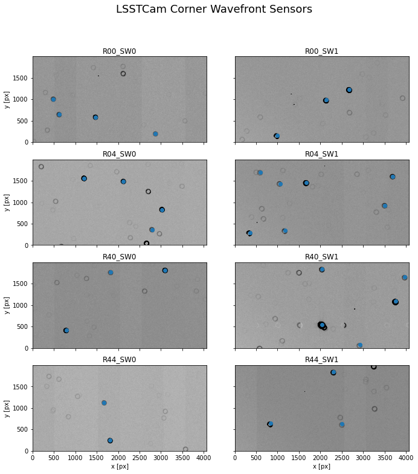
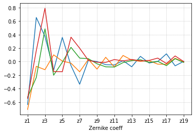

Inspect WEP
===========

This notebook is part of the Integration Milestone pf, which involves
processing LSSTCam corner wavefront sensor data with the MTAOS and
issuing correction to the AOS components.

This notebook is designed to inspect the results of the WEP execution by
inspecting the data stored in the butler.

Details about the milestone, execution and verification can be found in
`tstn-031 <https://tstn-031.lsst.io>`__.

.. code:: ipython3

    import numpy as np 
    import os 
    
    from lsst.daf import butler as dafButler
    import lsst.afw.cameraGeom.utils as cameraGeomUtils
    import lsst.afw.display as afwDisplay
    import matplotlib.pyplot as plt
    from matplotlib import rcParams 
    from astropy.io import fits
    from astropy.visualization import ZScaleInterval
    

.. code:: ipython3

    instrument = "LSSTCam"
    repo_dir = "/scratch/IM_Pf/LSSTCam"

.. code:: ipython3

    mtaos_run = "mtaos_wep_tribeiro_nb_tribeiro_20220304T234403714"

.. code:: ipython3

    butler = dafButler.Butler(
        repo_dir, 
        collections=[
            f"{instrument}/raw/all",
            mtaos_run,
        ],
    )

.. code:: ipython3

    exp_num = 4021123110021

Corner Wavefront Sensors and Source Selection
---------------------------------------------

The following is a display of the post-isr corner wavefront sensor data
overlaid with the positions of the selected sources.

.. code:: ipython3

    fig, ax = plt.subplots(4, 2, figsize=(12,12))
    
    for index, detector in enumerate(
        [
        'R00_SW0',
        'R00_SW1',
        'R04_SW0',
        'R04_SW1',
        'R40_SW0',
        'R40_SW1',
        'R44_SW0',
        'R44_SW1'
        ]
    ):
        
        post_isr_exposure = butler.get(
            "postISRCCD", 
            detector=detector, 
            instrument=instrument,
            exposure=exp_num,
            collections=[mtaos_run],
        )
        
        donut_catalog = butler.get(
            "donutCatalog", 
            detector=detector, 
            instrument=instrument,
            visit=exp_num,
            collections=[mtaos_run],
        )
        
        data = post_isr_exposure.image.array
        
        zscale = ZScaleInterval()
        
        vmin, vmax = zscale.get_limits(data)
        
        line = int(np.floor(index / 2))
        column = index % 2
    
    
        ax[line][column].imshow(
            post_isr_exposure.image.array,
            vmin=vmin,
            vmax=vmax,
            cmap="Greys",
            origin="lower"
        )
        
        ax[line][column].scatter(
            donut_catalog["centroid_x"],
            donut_catalog["centroid_y"],
        )
    
        ax[line][column].set_title(f"{post_isr_exposure.getDetector().getName()}")
        
        if line == 3:
            ax[line][column].set_xlabel("x [px]")
        
        if column == 0:
            ax[line][column].set_ylabel("y [px]")
        
        if column == 1:
            ax[line][column].set_yticklabels([])
        
        if line < 3:
            ax[line][column].set_xticklabels([])
            
    fig.suptitle(
        f"{instrument} Corner Wavefront Sensors",
        fontsize=18
    )
    plt.subplots_adjust(wspace=0.)

Average Zernike Values
----------------------

The following is a plot of the resulting wavefront errors averaged for
each corner wavefront sensor.

.. code:: ipython3

    fig, ax = plt.subplots(1, 1)
    
    for detector in [191, 195, 199, 203]:
        zernike_estimate_avg = butler.get(
            "zernikeEstimateAvg", 
            detector=detector, 
            instrument=instrument,
            visit=exp_num,
            collections=[mtaos_run],
        )
        ax.plot(zernike_estimate_avg)
    
    x_ticks = np.arange(0, 19, 2)
    ax.set_xticks(x_ticks)
    ax.set_xticklabels([f"z{index+1}" for index in x_ticks])
    ax.set_xlabel("Zernike coeff")
    
    ax.grid(linestyle=":")

